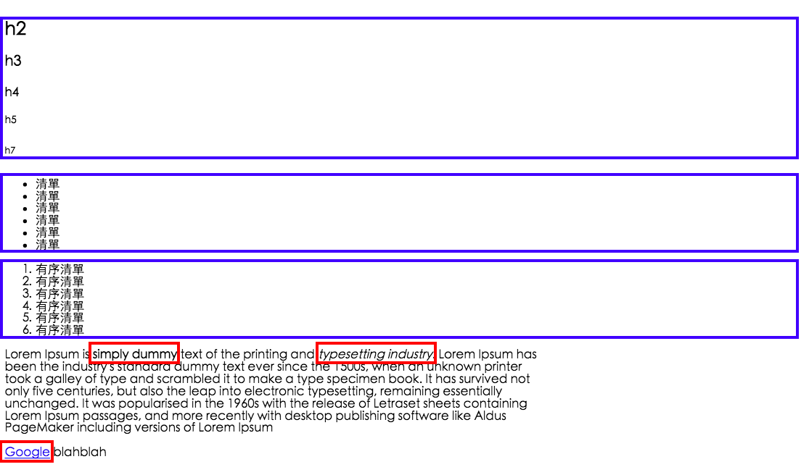

#
## CSS Reset
#### meyerweb CSS
讓網頁排版在各個瀏覽器的排版一致，徹底清掉 CSS
http://meyerweb.com/eric/tools/css/reset/

`demo_reset_css1.html`

#### Normalize css
把必要的譬如粗體，斜體留著
https://necolas.github.io/normalize.css/

`demo_reset_css2.html`

## Block and inline
#### Block 區段
會佔位，會佔掉一整個列，也可設定寬高，
ex: `<ul>`, `<ol>`, `<p>`, `<div>`

#### Inline 區段
不會佔位，不會佔掉一整個列，設定寬高會無效，
ex: `<strong>`, ``, `<a>`

下圖藍色為block，紅色為inline


#### block_inline
每個物件都可以設定面積，會佔空間，但是不會佔掉一整列，所以一個個的區塊可以排成列，排列上預設不同大小的物件會靠底部

## Position
- static 靜態：很少用到
- relative 相對：自身偏移
  - top, left, right, left 等設定是相對於**資料流**的偏移
- absolute 絕對：定位於父層，但又有很多例外設定
  - 找父層有沒有設定定位(relative, absolute, fixed 三種)，如果沒有，就繼續往上找
  - 找到的話，就會靠著那一層做絕對定位
  - 使用這個的話，會讓物件抽離資料流
- fixed 固定：固定於視窗

請看 `demo_position` folder 裡的範例:
- `demo_position`:
  - 基本的 `relative`, `absolute` 效果
- `demo_inlineblock`, `demo_inlineblock2`
  - 展示 `inline-block`的排列效果
- `demo_position_fixed`
  - 利用`position: fixed;` 做側邊廣告
- `demo_position_lightbox`:
  - 利用 `position: absolute;` 做佔全頁的廣告
- `demo_position_navbar`,`demo_position_navbar2`
  - 分別用 `float`和 `position` 做出 navbar 效果
- `demo_position_rwb`
  - rwb範例

## CSS selector
- S `space` B: A 底下所有的 B 物件
- A `>` B: A下一層的 B 物件
- A `+` B: 緊跟在 A 後面的 B
- A `~` B: A 之後的所有物件 b

看`demo_selector.html`

## CSS color
- hsla
- rgba

## CSS layer
在沒有調整`z-index`的情況下
```html
<div class="container">
  <div class="aa"><div>
  <div class="bb"><div>
</div>
```
bb 會蓋住 aa

## 綜合應用
使用 `:hover` selector 搭配 `position`

`demo_item_catalog1.html` 和 `demo_item_catalog2.html`
